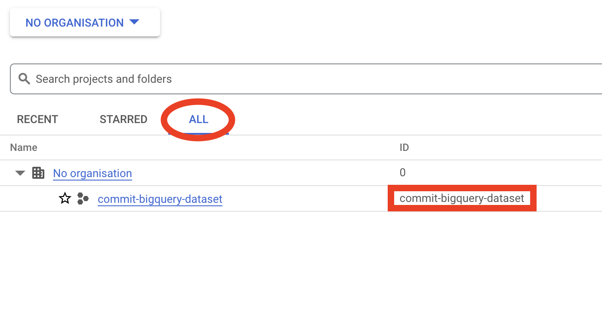

# Commit GCP Customer Onboarding

This repository contains an automated onboarding process for Commit-GCP customers.

Click the open in Cloud Shell button below and select "Trust repo" and "confirm" to begin. Instructions will appear on the right side of the screen.

[Google Cloud Shell](https://cloud.google.com/shell/docs/) is a hosted
development environment managing resources hosted on Google Cloud Platform.

---

  
## Instructions for Finding Relevant Information

### Organization ID:

You will be prompted for your Organization ID. To find this, in the GCP Console, in the top toolbar, left of the search bar, click the dropdown menu and go to the "ALL" tab. Your Organization ID should be next to your Organization name.

### Project ID:

To find a project ID, in the GCP Console, in the top toolbar, left of the search bar, click the dropdown menu and find your project name (If you don't see it, go to the "ALL" tab). Its project ID should be next to its name (these are often the same, but not always).

### Billing Account ID:

You will be prompted for a Billing Account ID. To find this, go to the Billing page: https://console.cloud.google.com/billing and click on the name of the desired sub-billing account, and go to "Account Management" in the toolbar on the left.