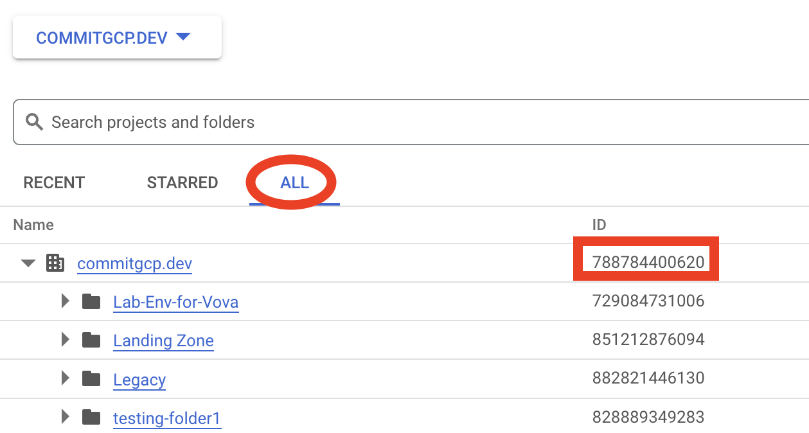

# Commit GCP Onboarding


## Let's get started!

We're going to go through a few short steps to get you set up and working with the Commit GCP team!

**Time to complete**: About 5-10 minutes

Click the **Start** button to move to the next step.


## Step 1 - Read Only Permissions on Organization

The first step is to grant read-only permissions to Commit's support team on the customer's organization. We recommend that the client give us permissions as viewers so that our support team can provide a better service, however this is not mandatory. There are clients who prefer not to provide these permissions for compliance or privacy reasons. To grant the permissions,
execute the command below:

```bash
./1_organization_permissions.sh
```

You will be prompted for your Organization ID. To find this, in the GCP Console, browse to your "Organization Root" resource:



## Step 2 - Billing Administrator Permissions

Try running a command now:
```bash
echo "Hello Cloud Shell"
```

**Tip**: Click the copy button on the side of the code box and paste the command in the Cloud Shell terminal to run it.

Next, we'll finish up.


## Congratulations

<tutorial-conclusion-trophy></tutorial-conclusion-trophy>

You’re all set!

